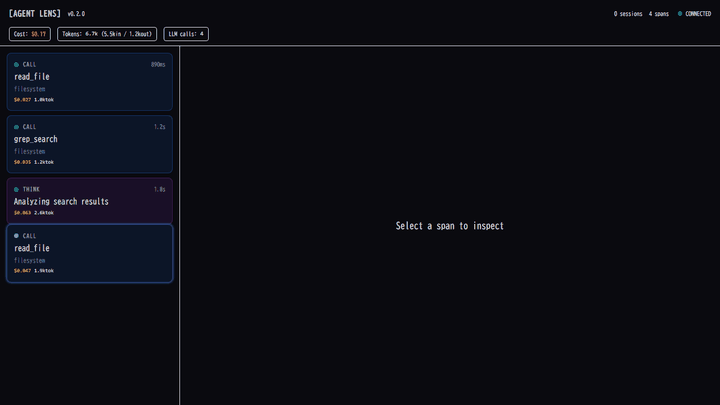

<p align="center">
  <br/>
  
  <br/><br/>
  <strong>The Git for AI Agents:</strong><br/>
  <strong>Rewind, Branch, and Debug Multi-step Reasoning in Real-time.</strong>
  <br/><br/>
</p>

<p align="center">
  <a href="#30-second-demo">Demo</a> &bull;
  <a href="#quick-start">Quick Start</a> &bull;
  <a href="#features">Features</a> &bull;
  <a href="#inference-economics">Cost Tracking</a> &bull;
  <a href="#openclaw-integration">OpenClaw</a> &bull;
  <a href="#architecture">Architecture</a> &bull;
  <a href="docs/">Docs</a>
</p>

<p align="center">
  
  <br/>
  
  
  
  
</p>

---

## 30-Second Demo

<!-- HERO GIF: Record with `pnpm demo` then capture with any screen recorder -->
<p align="center">
  
</p>

> **What you're seeing:** An OpenClaw agent tries to fix a broken API endpoint. It edits the wrong file at step 8. The operator right-clicks that span, selects **"Fork Here"**, adjusts the context, and watches the agent take the correct path on a new branch — all while the original (failed) timeline is preserved for comparison. Cost: $0.03 for the fix, vs $0.47 wasted on the wrong path.

```
Agent thinks  ──→  reads file  ──→  searches code  ──→  ⚡ shell_execute
                                                          │
                                                    APPROVAL GATE
                                                    ┌─────────────────┐
                                                    │ rm -rf ./cache  │
                                                    │                 │
                                                    │ [Risk: HIGH]    │
                                                    │                 │
                                                    │ ✅ Approve      │
                                                    │ ✏️  Modify       │
                                                    │ ❌ Reject       │
                                                    └─────────────────┘
                                                          │
                    edits wrong file (step 8) ←───────────┘
                          │
                    ⚡ RIGHT-CLICK → "Fork Here"
                          │
              ┌───────────┴───────────┐
              │                       │
         [Original]              [New Branch]
         ❌ wrong fix             ✅ correct fix
         $0.47 wasted             $0.03 cost
```

<details>
<summary><strong>Run the demo yourself</strong></summary>

```bash
git clone https://github.com/bearwash/agent-lens.git
cd agent-lens && pnpm install

# Terminal 1: Start proxy + dashboard
pnpm dev

# Terminal 2: Run the demo scenario
pnpm --filter @agent-lens/proxy run demo

# Open http://localhost:3000 and watch the magic
```

</details>

---

## Why Does This Matter Now?

In 2026, AI agents autonomously execute multi-step tasks — booking flights, deploying code, managing infrastructure. When they go wrong, the damage is real:

| Problem | Scale |
|---------|-------|
| Enterprise inference costs | **$10M+/month** and growing 40% QoQ |
| Agent errors caught post-hoc | Average **$2,400** per incident to remediate |
| Regulatory compliance (AI Safety Act) | **Mandatory audit trails** by Q4 2026 |

**Existing tools show you the crash report. Agent Lens gives you the steering wheel.**

LangSmith, Langfuse, and Datadog GenAI Monitoring are *post-mortem* tools. None of them let you:

- **Pause** an agent mid-execution to inspect a dangerous tool call
- **Edit** the agent's reasoning and re-run from any checkpoint
- **Branch** the timeline to compare "what if?" scenarios
- **Track cost in real-time** per reasoning step, per branch

Agent Lens does all of this, **100% local**, with **zero cloud dependency**.

---

## Quick Start

```bash
git clone https://github.com/bearwash/agent-lens.git
cd agent-lens
pnpm install
pnpm build
```

### 1. Demo Mode (try it instantly)

```bash
pnpm demo
# Open http://localhost:3000
# A simulated 17-step agent session plays automatically
```

### 2. Real Agent Mode

```bash
pnpm dev
# Open http://localhost:3000
```

| Service | URL | Purpose |
|---------|-----|---------|
| Dashboard | http://localhost:3000 | Real-time visualization UI |
| Proxy WS | ws://localhost:18790 | WebSocket for dashboard + ingest |
| HTTP Proxy | http://localhost:18791 | MCP Streamable HTTP proxy |
| REST API | http://localhost:18790/api/* | Sessions, spans, firewall, audit |

### Connect any agent

**Option A: REST API (simplest)**

Send spans from any language/tool via HTTP:

```bash
# 1. Create a session
curl -X POST http://localhost:18790/api/ingest/session \
  -H "Content-Type: application/json" \
  -d '{"sessionId":"my-session","agentSystem":"my-agent","startedAt":'$(date +%s000)',"status":"running","rootBranchId":"main","activeBranchId":"main","metadata":{"traceId":"trace-001"}}'

# 2. Send spans (they appear in the dashboard immediately)
curl -X POST http://localhost:18790/api/ingest/span \
  -H "Content-Type: application/json" \
  -d '{"traceId":"trace-001","spanId":"span-001","name":"read_file: index.ts","kind":"tool_call","startTime":'$(date +%s000)',"endTime":'$(($(date +%s000)+500))',"status":"ok","attributes":{"gen_ai.system":"claude","agent_lens.mcp.tool":"read_file"},"events":[]}'
```

**Option B: WebSocket (real-time streaming)**

```javascript
const ws = new WebSocket("ws://localhost:18790");
ws.onopen = () => {
  // Register session
  ws.send(JSON.stringify({ type: "ingest:session", session: { sessionId: "s1", agentSystem: "my-agent", startedAt: Date.now(), status: "running", rootBranchId: "main", activeBranchId: "main" } }));
  // Send span
  ws.send(JSON.stringify({ type: "ingest:span", span: { traceId: "t1", spanId: "sp1", name: "thinking", kind: "thinking", startTime: Date.now(), status: "ok", attributes: { "agent_lens.reasoning": "Analyzing the code..." }, events: [] } }));
};
```

**Option C: MCP stdio proxy (wrap an MCP server)**

```bash
# Agent Lens intercepts all traffic between agent and MCP server
echo '{"jsonrpc":"2.0","id":1,"method":"tools/list"}' \
  | node apps/proxy/dist/index.js npx @modelcontextprotocol/server-filesystem /tmp
```

**Option D: MCP HTTP proxy (transparent)**

```bash
# Point your agent at localhost:18791, set X-MCP-Target header
curl -X POST http://localhost:18791 \
  -H "Content-Type: application/json" \
  -H "X-MCP-Target: https://your-mcp-server.com" \
  -d '{"jsonrpc":"2.0","id":1,"method":"tools/list"}'
```

### Test it works

```bash
# With proxy running in another terminal:
pnpm test:ingest
# → Sends 6 sample spans, visible at http://localhost:3000
```

### Docker (PostgreSQL + persistent storage)

```bash
cd docker && docker compose up
```

---

## 使い方（日本語）

```bash
git clone https://github.com/bearwash/agent-lens.git
cd agent-lens
pnpm install && pnpm build
```

### デモモード（すぐ試せる）

```bash
pnpm demo
# → http://localhost:3000 を開く（17ステップのデモが自動再生）
```

### 実際のエージェントと接続

```bash
pnpm dev
# → http://localhost:3000 を開く
```

スパンの送信方法:

```bash
# セッションを作成
curl -X POST http://localhost:18790/api/ingest/session \
  -H "Content-Type: application/json" \
  -d '{"sessionId":"s1","agentSystem":"my-agent","startedAt":1700000000000,"status":"running","rootBranchId":"main","activeBranchId":"main","metadata":{"traceId":"t1"}}'

# スパンを送信（ダッシュボードにすぐ表示される）
curl -X POST http://localhost:18790/api/ingest/span \
  -H "Content-Type: application/json" \
  -d '{"traceId":"t1","spanId":"sp1","name":"ファイル読み取り","kind":"tool_call","startTime":1700000000000,"endTime":1700000001000,"status":"ok","attributes":{"agent_lens.mcp.tool":"read_file"},"events":[]}'
```

動作確認:
```bash
pnpm test:ingest
# → 6つのテストスパンが送信され、ダッシュボードに表示される
```

---

## Features

### Approval Gate — Stop Dangerous Actions Before They Execute

```typescript
// Built-in rules (fully customizable)
{ tool: "shell_*",    risk: "high"     }  // Block shell commands
{ tool: "*delete*",   risk: "critical" }  // Block destructive ops
{ tool: "*payment*",  risk: "critical" }  // Block financial actions
```

When a rule matches, the agent **freezes**. You see the full request in the dashboard and choose:
- **Approve** — let it through
- **Modify** — change the arguments, then approve
- **Reject** — agent receives an error and must adapt

No more "the agent deleted production data while I was at lunch."

### Time-Travel Branching — `git checkout` for Agent Reasoning

Right-click any span in the timeline → **Fork Here** → the agent restarts from that exact checkpoint.

- **Both timelines are preserved** — the failed path and the corrected path live side by side
- **Compare branch outcomes** — see which approach was cheaper, faster, more correct
- **Unlimited depth** — branches can fork from branches
- **Git-style tree visualization** — see the full reasoning topology at a glance

This is the feature that doesn't exist anywhere else. Not in LangSmith. Not in Langfuse. Not in Datadog.

### Multimodal Attachment Viewer

2026 agents handle images, screenshots, video, and sensor data. Agent Lens renders them inline:

- **Screenshots**: See exactly what the agent "saw" when it clicked that button
- **Images**: Camera input, generated diagrams, chart captures
- **Video/Audio**: Playback directly in the span detail panel
- **Sensor data**: IoT device readings with metadata overlay

Debug "why did the agent click the wrong button?" by viewing the screenshot **at that exact reasoning step**.

### Agentic Firewall — Security Layer for Autonomous Agents

> *In response to CVE-2026-25253 (ClawHub token theft), Agent Lens now ships a built-in threat detection engine.*

Every MCP tool call is scanned against known attack patterns **before execution**:

| Category | Examples | Default Action |
|----------|----------|---------------|
| Token Theft | Exfiltration to suspicious URLs, cookie/token capture | **Block** |
| Shell Injection | `; rm -rf`, `` `curl` ``, pipe chains | **Block** |
| Data Exfiltration | Base64-encoding `.env`, `curl` to external IPs | **Block** |
| Credential Access | Reading `.ssh/*`, `credentials.json`, `~/.aws` | **Alert** |
| Supply Chain | `npm install` from non-registry sources | **Alert** |
| Destructive | `DROP TABLE`, `format`, `fdisk` | **Block** |

```
Mode: ENFORCE (blocks) or MONITOR (alerts only)
Risk Score: 0-100 per request, auto-block above threshold
Custom Rules: Add your own regex patterns via REST API
```

Not just a debugger — an **agentic firewall** that CISOs can actually deploy.

### Claude Code Native Support

Agent Lens works as a transparent observation layer for [Claude Code](https://docs.anthropic.com/en/docs/claude-code):

```typescript
import { generateMcpConfig } from "@agent-lens/claude-code-adapter";

// Generates the MCP config to route Claude Code through Agent Lens
const config = generateMcpConfig({ proxyPort: 18791 });
```

- Auto-detects Claude Code sessions and model (Opus/Sonnet/Haiku)
- Maps all Claude Code tools (Read, Edit, Bash, Grep, etc.) to categorized spans
- Extracts thinking blocks as reasoning spans
- Maps Claude Code's permission system to Approval Gate
- Auto-configures cost tracking based on detected model

Works with every Claude Code tool: `Read`, `Write`, `Edit`, `Bash`, `Grep`, `Glob`, `WebFetch`, `Agent`, and more.

---

## Inference Economics

> *"We were spending $340K/month on agent inference before we could even see which steps were burning tokens."*
> — Every enterprise AI team in 2026

Agent Lens tracks **cost per reasoning step** in real-time:

```
┌──────────────────────────────────────────────┐
│  Session Cost: $1.24          Tokens: 847.2k │
│  ████████████░░░░░░░░  Input: 612k ($0.31)   │
│  ██████████████████░░  Output: 235k ($0.93)  │
│                                              │
│  LLM Calls: 23    Avg: $0.054/call           │
└──────────────────────────────────────────────┘
```

**Per-span breakdown:**
- Input vs. output token split with cost in USD
- Color-coded severity: 🟢 < $0.01 → 🟡 < $0.10 → 🟠 < $1.00 → 🔴 $1.00+
- **Branch cost comparison**: "The corrected branch cost $0.03. The original mistake cost $0.47."

**Pre-loaded pricing** for Claude (Opus/Sonnet/Haiku), GPT-4o/4.1, Gemini 3 Pro/Flash. Custom models supported.

When you fork a branch to try a different approach, you can see **exactly how much each experiment costs** before committing to a strategy. This turns agent debugging from guesswork into engineering.

---

## OTel GenAI 1.37+ — Full Compliance, Zero Config

Every span emits the complete [OpenTelemetry GenAI Semantic Conventions](https://opentelemetry.io/docs/specs/semconv/gen-ai/) attribute set:

| Attribute | Description |
|-----------|-------------|
| `gen_ai.system` | Provider: `openclaw`, `claude`, `openai` |
| `gen_ai.request.model` | Requested model ID |
| `gen_ai.response.model` | Actual model used |
| `gen_ai.response.finish_reason` | `stop`, `length`, `tool_use`, `content_filter` |
| `gen_ai.usage.input_tokens` | Input token count |
| `gen_ai.usage.output_tokens` | Output token count |
| `gen_ai.task` | High-level task description |
| `gen_ai.action` | Tool name or action taken |

**Export anywhere** — built-in `toOtlpSpan()` converter sends data to Datadog, Grafana, Jaeger, or any OTLP-compatible backend. Agent Lens isn't a walled garden; it's a **standards-compliant observation layer** that plays nicely with your existing stack.

---

## OpenClaw Integration

Agent Lens is built as a first-class [OpenClaw](https://github.com/openclaw) `context-engine` plugin:

```typescript
import { createPlugin } from "@agent-lens/openclaw-plugin";

export default {
  plugins: [
    createPlugin({
      proxyUrl: "ws://localhost:18790",
      agentSystem: "openclaw",
      model: "claude-opus-4-6",
    }),
  ],
};
```

**Hooks into three OpenClaw lifecycle events:**
- `bootstrap` — initializes the debug session
- `ingest` — converts gateway events to OTel spans in real-time
- `assemble` — injects approval gate context into LLM prompts

Works with OpenClaw v2026.3.7+ via the Gateway WebSocket API on port 18789.

---

## Architecture

```
┌─────────────┐                        ┌──────────────┐                    ┌────────────┐
│             │     stdio / HTTP       │              │     JSON-RPC      │            │
│   Agent     │ ─────────────────────→ │  Agent Lens  │ ─────────────────→│ MCP Server │
│             │ ←───────────────────── │    Proxy     │ ←─────────────────│            │
│  OpenClaw   │     responses          │              │    responses      └────────────┘
│  Claude Code│                        │  ┌────────┐  │
│  Custom     │                        │  │ OTel   │  │───→ OTLP Export (Datadog, Grafana, Jaeger)
└─────────────┘                        │  │ Spans  │  │
                                       │  └────────┘  │
                                       │  ┌────────┐  │     WebSocket
                                       │  │Approval│  │───→ ┌───────────────────────────┐
                                       │  │ Gate   │  │     │      Dashboard            │
                                       │  └────────┘  │←─── │   Next.js 15 + Tailwind   │
                                       │  ┌────────┐  │     │                           │
                                       │  │ Cost   │  │     │  ┌─────┐ ┌──────┐ ┌────┐ │
                                       │  │Tracker │  │     │  │Time │ │Span  │ │Cost│ │
                                       │  └────────┘  │     │  │line │ │Detail│ │Bar │ │
                                       └──────────────┘     │  └─────┘ └──────┘ └────┘ │
                                              │             └───────────────────────────┘
                                       ┌──────┴──────┐
                                       │   Store     │
                                       │ ┌─────────┐ │
                                       │ │In-Memory│ │  ← Dev mode
                                       │ └─────────┘ │
                                       │ ┌─────────┐ │
                                       │ │ Postgres│ │  ← Production (WORM / Audit)
                                       │ │ 17+pgau │ │
                                       │ └─────────┘ │
                                       └─────────────┘
```

## Monorepo

```
agent-lens/
├── apps/
│   ├── dashboard/              # Next.js 15 + Tailwind v4 — real-time debug UI
│   └── proxy/                  # MCP observation proxy (stdio + Streamable HTTP)
├── packages/
│   ├── protocol/               # Shared TypeScript types (MCP, OTel, Branches)
│   ├── otel-config/            # OTel 1.37+ GenAI helpers + cost calculator + OTLP export
│   ├── store/                  # Storage abstraction (MemoryStore + PgStore WORM + AuditTrail)
│   ├── openclaw-plugin/        # OpenClaw context-engine integration
│   └── claude-code-adapter/    # Claude Code native observation adapter
├── docker/                     # Docker Compose (PostgreSQL 17 + proxy + dashboard)
├── pnpm-workspace.yaml
└── 4,200+ lines of TypeScript
```

---

## Roadmap

### Delivered

- [x] **Phase 1**: Real-time span visualization with WebSocket streaming
- [x] **Phase 2**: Approval Gate — pause, inspect, modify dangerous tool calls
- [x] **Phase 3**: Time-travel branching — Fork, Rewind, compare alternate timelines
- [x] **Multimodal**: Inline image/video/screenshot viewer per span
- [x] **Inference Economics**: Per-span USD cost tracking with cumulative display
- [x] **OTel 1.37+**: Full GenAI Semantic Conventions + OTLP export
- [x] **PostgreSQL WORM**: Append-only audit-grade storage with pgaudit
- [x] **OpenClaw Plugin**: First-class context-engine integration
- [x] **Agentic Firewall**: IOC-based threat detection with CVE-2026-25253 coverage
- [x] **Claude Code Adapter**: Native observation for Anthropic's Claude Code
- [x] **Reconstitution of Intent**: SHA-256 chained audit trail with JSONL/CSV export (AI Safety Act 2026)

### Phase 5: Scale & Ecosystem (Next)

- [ ] **P2P Debug Sync** — Sync debug sessions across devices (PC ↔ tablet ↔ phone) using libp2p, with zero server infrastructure
- [ ] **Visual Branch Diff** — Side-by-side comparison of branch outcomes with token/cost delta highlighting
- [ ] **Collaborative Approval** — Generate secure one-time URLs for manager/stakeholder approval of high-risk actions
- [ ] **Firewall Dashboard UI** — Real-time threat map with block/allow/alert statistics
- [ ] **ClawHub Marketplace** — Official listing as OpenClaw's recommended debug stack
- [ ] **Rust High-Throughput Proxy** — Handle 10,000+ spans/sec for production fleet monitoring

---

## Contributing

Agent Lens is MIT licensed. Contributions welcome.

```bash
# Development
pnpm install
pnpm dev          # Start proxy + dashboard
pnpm build        # Build all packages
pnpm typecheck    # Type-check everything

# Demo
pnpm --filter @agent-lens/proxy run demo
```

---

<p align="center">
  <br/>
  <strong>Stop reading crash reports. Start steering your agents.</strong>
  <br/><br/>
  <a href="#quick-start">Get Started</a> &bull;
  <a href="https://github.com/bearwash/agent-lens/issues">Report Issue</a> &bull;
  <a href="https://github.com/bearwash/agent-lens/discussions">Discuss</a>
  <br/><br/>
  MIT License &copy; 2026
</p>
